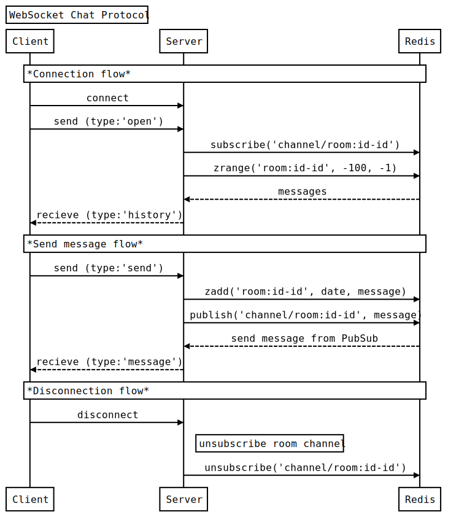

# チャットアプリの試作

RedisのPubSubを利用したWebSocketチャットアプリ

## Redisデータ構造

### 会話履歴

key: `room:${user_id}-${user_id}` (user_idは常に昇順)
type: zset
score: date
member: JSON string

```json
{
  "message_id": "${room}/${uuid}",
  "user_id": 0, // 発言者のユーザーID
  "message": "", // メッセージ本文
  "date": "2018-09-19T05:22:50.965Z", // 投稿日時(UTC)
}
```

- 会話履歴はチャットルームごとに最大件数まで保持
- 最大件数を超えた会話は削除される

### 未読メッセージ

key: unread:${user_id}
type: set
member: message_id


## WebSocket通信フロー


